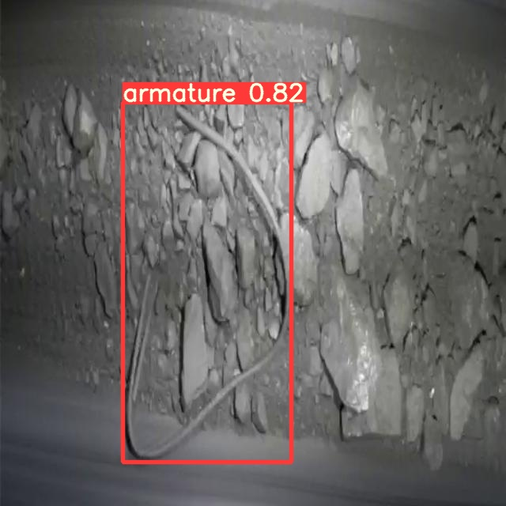
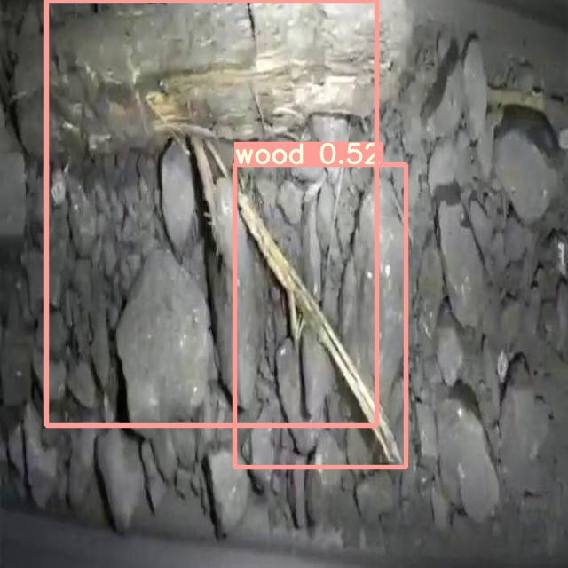
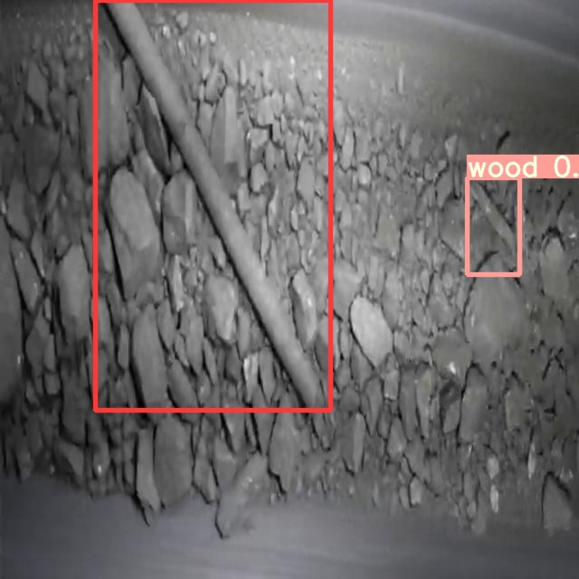
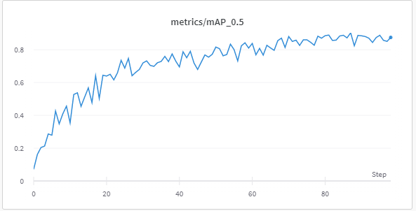

# nornikel-ore-contamination-detection
This is solution of competition task https://www.kaggle.com/c/nornikel-ore-contamination-detection/submissions. Transfer learing of the YOLO v5 model shows good results and can be used in problems of this kind. This repo might be helpful as an example that implements [train YOLOv5 custom data.](https://github.com/ultralytics/yolov5/wiki/Train-Custom-Data)

# Project steps:
1. EDA of data.
2. Transform images and labels to YOLO v5 format
3. Train model
4. Predict
5. Make submission file

# Recap:

 
The model is not perfect, but quite accurately detects objects on the transporter. 
  

# Instead of end:
Here is an idea, let artificial intelligence replace humans when sorting garbage, the solution is simple: we will sort plastic bottles by blowing them into a container with an air jet, the signal of which will be given by YOLO. Let's make the world a better and cleaner 😊!

